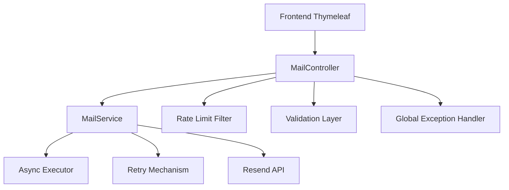

# <p align="center">🚀 MailAPI</p>

<p align="center">
  API profissional de envio de e-mails desenvolvida com Spring Boot
</p>

<p align="center">
  
  
  
  
  
  
  
</p>

---

# 🌐 Preview do Sistema

<p align="center">
  
</p>

<p align="center">
  
</p>

---

# ✨ Sobre o Projeto

A **MailAPI** é uma API profissional de envio de e-mails desenvolvida com **Java + Spring Boot**, criada para fornecer uma solução moderna, escalável e resiliente para aplicações que necessitam de comunicação por e-mail.

O projeto foi arquitetado utilizando conceitos avançados de backend, incluindo:

* Processamento assíncrono
* Retry automático
* Rate limiting
* Monitoramento
* Tratamento global de exceções
* Documentação OpenAPI
* Containerização com Docker

Além da API REST, o sistema possui uma interface moderna desenvolvida com **Thymeleaf**, permitindo testes reais diretamente pelo navegador.

---

# 🏛️ Arquitetura da Aplicação

```text
Frontend (Thymeleaf)
        ↓
REST Controller
        ↓
Service Layer
        ↓
Retry + Async Executor
        ↓
Resend Email API
```

---

# 📐 Fluxo Arquitetural



---

# 🧠 Conceitos Aplicados

* Clean Code
* Layered Architecture
* DTO Pattern
* RESTful API
* Async Processing
* Retry Pattern
* Rate Limiting
* Dockerization
* Validation Layer
* OpenAPI Documentation
* Exception Handling
* Monitoring & Observability
* Logging Strategy
* Environment Variables
* Separation of Concerns

---

# 🧠 Principais Funcionalidades

## ✅ Envio de E-mails HTML

Permite envio de mensagens HTML personalizadas via API.

---

## ✅ Processamento Assíncrono

Uso de `@Async` com `ThreadPoolTaskExecutor` para evitar bloqueios na thread principal.

```java
@Async("mailExecutor")
```

---

## ✅ Retry Inteligente

Sistema de retry automático com backoff exponencial.

```java
@Retryable(
    retryFor = {EmailSendingException.class},
    maxAttempts = 3,
    backoff = @Backoff(delay = 2000, multiplier = 2)
)
```

---

## ✅ Proteção Contra Spam

Rate limiting implementado utilizando Bucket4j.

* 5 requisições por minuto
* Controle por IP
* HTTP 429
* Headers personalizados

---

## ✅ Swagger/OpenAPI

Documentação interativa da API para testes rápidos.

---

## ✅ Docker Ready

Aplicação totalmente containerizada para ambientes modernos.

---

## ✅ Monitoramento

Integração com Spring Boot Actuator.

---

## ✅ Tratamento Global de Exceções

Estrutura padronizada de erros para APIs profissionais.

---

## ✅ Logs Estruturados

Logs detalhados para observabilidade e debugging.

---

# 📊 Métricas Técnicas

| Métrica          | Valor           |
| ---------------- | --------------- |
| Java Version     | 21              |
| Framework        | Spring Boot 3   |
| API Style        | REST            |
| Build Tool       | Maven           |
| Container        | Docker          |
| Template Engine  | Thymeleaf       |
| Documentation    | Swagger/OpenAPI |
| Architecture     | Layered         |
| Async Processing | Sim             |
| Retry Mechanism  | Sim             |
| Rate Limiting    | Sim             |
| Monitoring       | Spring Actuator |
| Testing          | JUnit + Mockito |
| Email Provider   | Resend          |

---

# 🛡️ Segurança e Resiliência

A aplicação foi desenvolvida com foco em confiabilidade, estabilidade e proteção contra falhas.

## Recursos implementados

* Retry automático em falhas temporárias
* Rate limiting por IP
* Tratamento global de exceções
* Logs estruturados
* Validação de payload
* Processamento assíncrono
* Uso de variáveis de ambiente
* Controle de concorrência
* Executor customizado
* Proteção contra spam

---

# 🏗️ Estrutura do Projeto

```bash
src
 ┣ main
 ┃ ┣ java/com/fauzy/emailservice
 ┃ ┃ ┣ config
 ┃ ┃ ┣ controller
 ┃ ┃ ┣ dto
 ┃ ┃ ┣ exception
 ┃ ┃ ┣ service
 ┃ ┃ ┗ service/impl
 ┃ ┣ resources
 ┃ ┃ ┣ static
 ┃ ┃ ┣ templates
 ┃ ┃ ┗ application.properties
 ┣ test
 ┃ ┗ java/com/fauzy/emailservice
```

---

# ⚙️ Tecnologias Utilizadas

| Tecnologia        | Descrição                     |
| ----------------- | ----------------------------- |
| Java 21           | Linguagem principal           |
| Spring Boot 3     | Framework backend             |
| Spring Web        | Construção da API REST        |
| Spring Validation | Validação de dados            |
| Spring Retry      | Retry automático              |
| Spring Async      | Processamento assíncrono      |
| Thymeleaf         | Frontend server-side          |
| Swagger/OpenAPI   | Documentação                  |
| Bucket4j          | Rate limiting                 |
| Docker            | Containerização               |
| Maven             | Gerenciamento de dependências |
| Resend API        | Serviço de e-mails            |
| Lombok            | Redução de boilerplate        |
| JUnit + Mockito   | Testes unitários              |

---

# 📬 Endpoints da API

## 📨 Enviar E-mail

```http
POST /api/v1/emails/send
```

### Request

```json
{
  "to": "user@email.com",
  "subject": "Bem-vindo",
  "body": "<h1>Olá Mundo</h1>"
}
```

### Response

```json
{
  "message": "E-mail encaminhado para processamento",
  "timestamp": "2026-05-12T20:00:00"
}
```

---

## 📩 Formulário de Contato

```http
POST /api/v1/emails/contact
```

### Request

```json
{
  "name": "Fauzy",
  "senderEmail": "fauzy@email.com",
  "message": "Olá!"
}
```

---

# ❌ Tratamento de Erros

Exemplo de resposta padronizada:

```json
{
  "status": 400,
  "error": "Validation Error",
  "message": "O e-mail é obrigatório",
  "path": "/api/v1/emails/send",
  "timestamp": "2026-05-12T20:00:00"
}
```

---

# 📄 Swagger/OpenAPI

Documentação automática disponível em:

```bash
/swagger-ui.html
```

---

# 🌍 Deploy Online

## API Online

```bash
https://mailapi-production-f9f2.up.railway.app
```

## Swagger

```bash
https://mailapi-production-f9f2.up.railway.app/swagger-ui/index.html
```

---

# 🐳 Docker

## Build da imagem

```bash
docker build -t mailapi .
```

---

## Executar container

```bash
docker run -d \
  -p 8080:8080 \
  -e MAIL_PASSWORD=sua_api_key \
  --name mailapi \
  mailapi
```

---

## Ver logs

```bash
docker logs -f mailapi
```

---

# 🔐 Variáveis de Ambiente

```properties
PORT=8080

MAIL_PASSWORD=sua_api_key_resend

SPRING_MAIL_FROM=onboarding@resend.dev
```

---

# 📊 Observabilidade

Monitoramento via Spring Actuator:

```properties
management.endpoints.web.exposure.include=health,info,metrics
```

Endpoints disponíveis:

```bash
/actuator/health
/actuator/info
/actuator/metrics
```

---

# 🧪 Estratégia de Testes

A aplicação possui testes unitários focados em:

* Controllers
* Fluxo de requisições HTTP
* Validação de endpoints
* Respostas da API
* Integração MockMvc

Exemplo:

```java
mockMvc.perform(post("/api/v1/emails/send"))
```

---

# 🚀 Como Executar Localmente

## Clonar repositório

```bash
git clone https://github.com/FauzySousa/mailapi.git
```

---

## Entrar na pasta

```bash
cd emailservice
```

---

## Executar aplicação

```bash
./mvnw spring-boot:run
```

---

# 📌 Status do Projeto

✅ API REST funcional
✅ Frontend institucional
✅ Retry automático
✅ Async processing
✅ Rate limiting
✅ Docker Ready
✅ Swagger/OpenAPI
✅ Monitoramento
✅ Testes unitários
✅ Deploy Ready

---

# 🔮 Melhorias Futuras

* Pipeline CI/CD
* Testes de integração
* Cobertura de testes
* Kubernetes Deploy
* Sistema de filas
* Dashboard administrativo
* Autenticação JWT
* Métricas avançadas

---

# 👨‍💻 Autor

## Fauzy Sousa

Backend Developer focado em:

* Java
* Spring Boot
* APIs REST
* Microsserviços
* Docker
* Arquitetura Backend

---

# 🔗 Links

## GitHub

```bash
https://github.com/FauzySousa
```

## LinkedIn

```bash
https://www.linkedin.com/in/fauzy-sousa-974a98409
```

---

# ⭐ Objetivo do Projeto

Este projeto foi desenvolvido com foco em:

* Portfólio profissional
* Demonstração de arquitetura backend moderna
* Aplicação de boas práticas
* APIs resilientes
* Observabilidade
* Experiência próxima ao mercado real

---

# 📜 Licença

Este projeto está sob a licença MIT.

---

<p align="center">
  Desenvolvido com ❤️ por Fauzy Sousa
</p>
